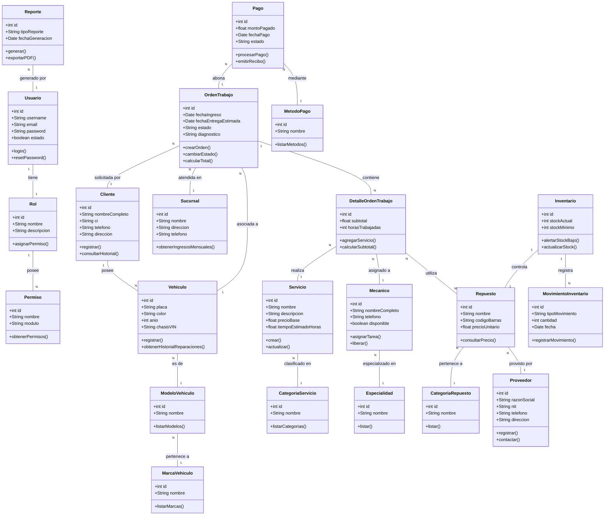

# ACTIVIDAD PRÁCTICA - CLASE 2
**PROGRAMACIÓN WEB II - GRUPO NOCHE**

**Proyecto:** Desarrollo de una Plataforma Web para Mejorar la Gestión de Servicios y Clientes de Talleres Automotrices de Santa Cruz de la Sierra.

---

## PARTE 1. IDENTIFICACIÓN DE MÓDULOS

Se han identificado los módulos principales solicitados para abarcar toda la gestión operativa y administrativa del taller, añadiendo 3 módulos adicionales clave para el flujo completo del negocio:

**Módulos Base:**
1. **Usuarios:** Gestión de cuentas de acceso al sistema.
2. **Roles:** Definición de perfiles y permisos.
3. **Clientes:** Registro y seguimiento de clientes del taller.
4. **Vehículos:** Historial y datos técnicos de los vehículos.
5. **Servicios:** Catálogo de servicios ofrecidos con precios y tiempos.
6. **Órdenes de Trabajo:** Núcleo del sistema, seguimiento de reparaciones y estados.
7. **Detalle de Orden:** Tareas específicas y repuestos dentro de una orden.
8. **Mecánicos:** Personal operativo y asignación de tareas.
9. **Repuestos:** Catálogo de piezas utilizables en reparaciones.
10. **Pagos:** Registro de ingresos por las órdenes de trabajo.
11. **Reportes:** Generación de estadísticas y resúmenes de ingresos/operaciones.

**Módulos Adicionales Propuestos:**
12. **Inventario:** Control estricto de entradas, salidas y alertas de stock mínimo para repuestos.
13. **Proveedores:** Gestión de empresas que suministran los repuestos al taller.
14. **Sucursales:** Permite la escalabilidad del sistema en caso de que el taller abra nuevas ubicaciones en Santa Cruz.

---

## PARTE 2 Y 3. DIAGRAMA DE CLASES Y DEFINICIÓN

El modelo cuenta con **22 clases** identificadas para soportar la arquitectura del sistema.

### Diagrama de Clases (UML)

### Definición de Clases (Resumen)
Se han definido 22 clases funcionales:
*   **Usuario, Rol, Permiso:** Controlan el acceso (Login, asignación de permisos según el cargo del empleado).
*   **Cliente, Vehículo, MarcaVehiculo, ModeloVehiculo:** Gestionan la base de datos comercial. Un cliente tiene vehículos, y los vehículos se normalizan por marcas y modelos.
*   **OrdenTrabajo, DetalleOrdenTrabajo:** El "Core" del sistema. La orden consolida la información general, y el detalle desglosa cada servicio individual que se le hace al coche.
*   **Servicio, CategoriaServicio:** El catálogo estandarizado de reparaciones y mantenimientos del taller.
*   **Mecanico, Especialidad:** Registra al personal técnico. Cada mecánico tiene especialidades (ej. Eléctrico, Chapista).
*   **Repuesto, CategoriaRepuesto, Proveedor:** Base de datos de materiales comprados a terceros.
*   **Inventario, MovimientoInventario:** Trazabilidad estricta de las piezas que entran por compras y salen por uso en reparaciones.
*   **Pago, MetodoPago:** Gestión financiera para la cancelación de las órdenes de trabajo.
*   **Reporte:** Entidad encargada de procesar consultas analíticas.
*   **Sucursal:** Módulo para separar datos lógicamente si el taller crece.

---

## PARTE 4. RELACIONES (CARDINALIDADES)

1.  Un **Usuario** tiene **un (1)** **Rol**, y un **Rol** es asignado a **muchos (N)** **Usuarios** (1:N).
2.  Un **Rol** puede tener **muchos (N)** **Permisos**, y un **Permiso** puede estar en **muchos (M)** **Roles** (M:N).
3.  Un **Cliente** posee **uno o muchos (1..N)** **Vehículos**, y un **Vehículo** pertenece a **un (1)** **Cliente**.
4.  Un **Vehículo** es de **un (1)** **ModeloVehiculo**, y un **ModeloVehiculo** pertenece a **una (1)** **MarcaVehiculo**.
5.  Una **Orden de Trabajo** es solicitada por **un (1)** **Cliente** para **un (1)** **Vehículo**, y se atiende en **una (1)** **Sucursal**.
6.  Una **Orden de Trabajo** está compuesta por **uno o muchos (1..N)** **DetalleOrdenTrabajo**.
7.  Un **DetalleOrdenTrabajo** corresponde a **un (1)** **Servicio** y es ejecutado por **un (1)** **Mecanico**.
8.  Un **DetalleOrdenTrabajo** puede utilizar **muchos (N)** **Repuestos**, y un **Repuesto** se usa en **muchos (M)** **Detalles** (M:N).
9.  Un **Mecánico** tiene **una o muchas (1..N)** **Especialidades**.
10. Un **Repuesto** cuenta con **un (1)** **Inventario** único, el cual registra **muchos (N)** **MovimientoInventario**.
11. Un **Repuesto** es suministrado por **un (1)** **Proveedor**.
12. Una **Orden de Trabajo** puede pagarse a través de **uno o muchos (1..N)** **Pagos** (pagos fraccionados o adelantos).
13. Un **Pago** se realiza a través de **un (1)** **MetodoPago** (Efectivo, QR, Tarjeta).

---

## PARTE 5. REGLAS DE NEGOCIO

1.  **Regla de Exclusividad de Taller:** Un vehículo no puede tener más de una "Orden de Trabajo" en estado "En reparación" simultáneamente.
2.  **Regla de Diagnóstico Obligatorio:** No se puede iniciar la ejecución de los servicios (cambio de estado a "En reparación") si la Orden de Trabajo no tiene un "diagnóstico" previamente aprobado por el Cliente.
3.  **Regla de Integridad de Inventario:** El stock de un Repuesto nunca puede ser menor a cero. Si al agregar un repuesto a un Detalle de Orden se excede el stock actual, el sistema debe bloquear la acción y notificar falta de stock.
4.  **Regla de Alerta de Stock:** Si el stock de un Repuesto iguala o cae por debajo de su valor `stockMinimo`, el sistema generará automáticamente una alerta en el Dashboard del administrador para solicitar su reposición al Proveedor.
5.  **Regla de Consistencia Financiera:** Una Orden de Trabajo solo cambiará automáticamente a estado "Finalizado" y "Pagado" cuando la sumatoria del monto de los Pagos recibidos iguale al Costo Total (Suma de Servicios + Suma de Repuestos utilizados).
6.  **Regla de Asignación de Especialidad (Extra):** Un Mecánico solo puede ser asignado a un "DetalleOrdenTrabajo" si su "Especialidad" coincide con la "CategoriaServicio" requerida (Ej. No asignar un Chapista a una reparación del Motor).
